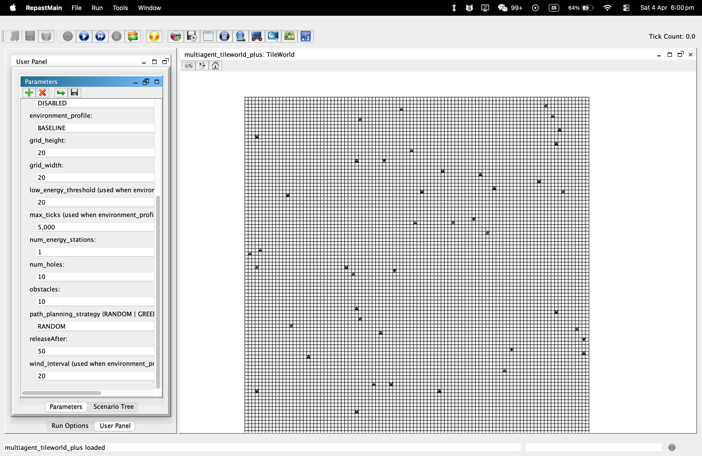
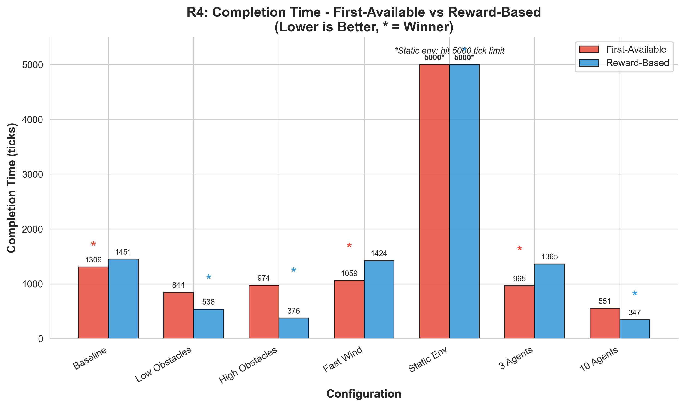
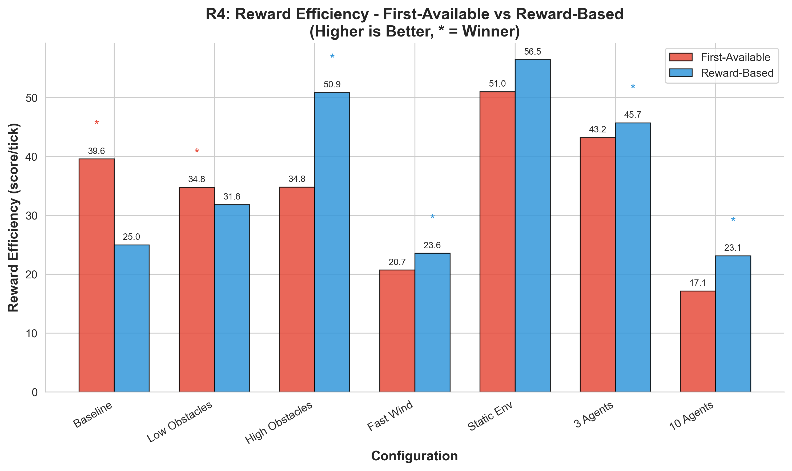
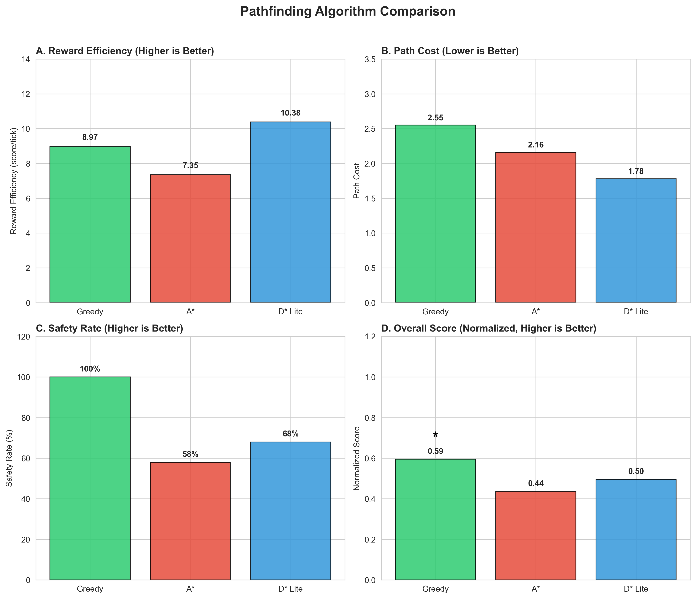
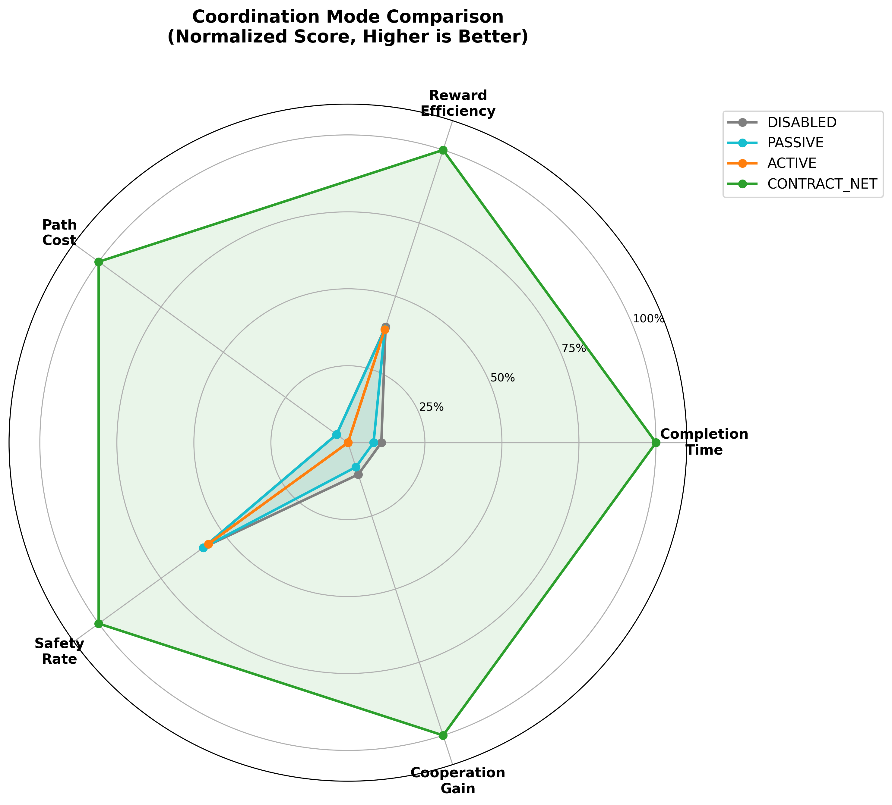

# Multi-Agent Tileworld: BDI Agents with Contract Net Collaboration in Dynamic Environments

**Author:** [Your Name] · **Student ID:** [SID]
**Course:** CSE5022 Advanced Multi-Agent Systems · **Date:** [Submission Date]

---

## 1. Introduction

### 1.1 The Tileworld Problem

The Tileworld is a classic grid-based testbed introduced by Pollack & Ringuette (1990) for evaluating rational agent behavior in dynamic environments. An agent gains reward by acquiring tiles and filling holes, but "wind" dynamics continuously relocate obstacles and tiles, forcing ongoing replanning and testing the coupling between perception, deliberation, and action.

In this project, I implement an extended multi-agent version of Tileworld that adds obstacles, energy management, and support for multiple coordination mechanisms. It provides a controlled setting to study BDI reasoning, proactive resource management, and collaborative task allocation.

### 1.2 Project Objectives

This work addresses five core requirements from the assignment:

1. **Dynamic environment (R1):** I implement a configurable grid where *only tiles and obstacles* change position at a user-defined interval, while holes, energy stations, and agents remain fixed. All parameters are exposed via the Repast GUI for experimentation.

2. **Single-agent BDI behavior (R2):** Each agent follows a complete Belief-Desire-Intention control loop to sense the environment, deliberate, and select actions. Agents must navigate around obstacles while maximizing score from filling holes.

3. **Energy management (R3):** Agents consume one unit of energy per move and must recharge at energy stations. I implement a proactive strategy to prevent energy depletion before agents can reach a station.

4. **Baseline evaluation (R4):** I empirically compare reward-oriented task selection against a "first available hole" baseline, measuring completion time and total score across multiple runs with varying parameters.

5. **Multi-agent collaboration (R5):** I implement the Contract Net Protocol for collaborative task allocation and compare its performance against the non-cooperative baseline to quantify the benefits of coordination.

### 1.3 Architecture Overview

I built this project on Repast Simphony 2.11.0 (Java 11) using a modular strategy-based design:

- **Strategy pattern:** Coordination, path planning, recharge, and task selection are all interfaces with multiple interchangeable implementations.
- **BDI core:** The `Agent` class implements the main BDI cycle, with beliefs, desires, and intentions structured in the `bdi` package.
- **Multiple path planners:** Greedy, A*, and D* Lite algorithms are provided for static and dynamic environments.
- **Coordination modes:** Disable, passive, active, and Contract Net coordination modes are all supported.
- **Built-in metrics:** Agent-level and simulation-level metrics are collected for benchmarking.

The following sections detail each component and present empirical results from my experiments.

---

## 2. R1: Dynamic Environment Implementation

### 2.1 Environment Configuration Parameters

All simulation parameters are exposed through the Repast Simphony GUI, allowing users to easily configure experiments without modifying code. Figure 1 shows the parameter configuration screen in the Repast runtime environment.


**Figure 1:** Repast Simphony runtime GUI showing all user-configurable parameters for the simulation.

#### 2.1.1 Basic Environment Parameters

The following core parameters can be adjusted directly via the GUI:
- **Grid dimensions**: Grid width and height (customizable from 20×20 to 100×100)
- **Entity counts**: Number of agents, holes, tiles, obstacles, and energy stations
- **Wind interval**: Dynamic environment update frequency (number of ticks between each repositioning)
- **Agent sensing range**: Maximum distance agents can detect obstacles and other entities
- **Initial agent energy**: Starting energy level for all agents
- **Maximum simulation ticks**: Hard stop condition for the simulation
- **Claim timeout**: Number of ticks after which an uncompleted claim is automatically released

#### 2.1.2 Strategy Selection Parameters

To facilitate rapid experimentation, the implementation also exposes high-level strategy selection parameters:
- **Coordination mode**: Dropdown selection between Disabled, Passive, Active, and Contract Net coordination
- **Path planning strategy**: Dropdown selection between Greedy, A*, and D* Lite (or mixed random assignment)
- **Environment profile**: Predefined configurations for common experiment types (FAST_CHANGE, LONG_RANGE, BASELINE, CUSTOM)

When a predefined profile is selected, the corresponding parameters are automatically set. CUSTOM mode allows users to manually adjust all parameters.

### 2.2 Dynamic Update Mechanism (The Wind Model)

Following the assignment requirements, only a subset of environment objects are dynamic, while others remain fixed throughout the entire simulation:

| Object Type  | Mobility | Reasoning |
|--------------|----------|-----------|
| Tiles        | **Dynamic** | Moved by wind to create planning challenges |
| Obstacles    | **Dynamic** | Moved by wind to create dynamic path planning |
| Holes        | **Fixed** | Holes are the persistent tasks to be completed |
| Energy Stations | **Fixed** | Known reference points for energy planning |
| Agents      | **Fixed** | Agents don't have fixed positions (they move themselves) |

#### 2.2.1 Update Algorithm

Dynamic updates are handled by the `Wind` class (`src/mas_tileworld/Wind.java`), which is scheduled to run every N ticks where N is the user-configurable wind interval. The update algorithm proceeds in five steps:

1. **Collection**: Gather all current tiles and obstacles from the context
2. **Candidate cell identification**: Identify all cells not occupied by fixed objects (holes, energy stations, agents) as candidate positions for relocation
3. **Random sampling**: Select N unique candidate cells without replacement for tiles and obstacles
4. **Relocation**: Move all tiles and obstacles to their new randomly selected positions
5. **Synchronization**: Update the shared grid representation and notify agents to trigger replanning

This approach guarantees that no overlaps occur after repositioning, as we only place dynamic objects on cells that are guaranteed to be free. The algorithm uses an efficient Fisher-Yates shuffle to sample without replacement, avoiding repeated random retries that can occur with naive sampling approaches.

#### 2.2.2 Grid Synchronization

After repositioning obstacles, the implementation synchronizes the global occupancy grid for A* pathfinding:
- Old obstacle positions are cleared from the shared grid
- New obstacle positions are marked as occupied
- All A* agents are notified to trigger a full replan

For D* Lite agents, each agent maintains its own local obstacle map and will incrementally update as it senses changes during normal movement. This preserves the incremental advantage of D* Lite in dynamic environments.

---

## 3. R2: Single-Agent Behavior

### 3.1 BDI Agent Architecture Design

The agent implementation follows the classical Belief-Desire-Intention (BDI) model (Wooldridge, 2003), adapted for the multi-agent Tileworld domain. Each agent executes a complete reasoning cycle every simulation tick.

#### 3.1.1 BDI Execution Cycle

The main execution loop is implemented in `Agent.java#run()`. Each tick executes six phases:

1. **Belief Construction** (`buildBeliefState()`): Sense the environment within sensing range to discover tiles, holes, obstacles, and other agents
2. **Belief Revision** (`reviseBeliefs()`): Drop invalidated intentions (e.g., target tile was picked up by someone else), update claims
3. **Desire Generation** (`DefaultDesireEvaluationStrategy.evaluate()`): Generate candidate goals based on current state
4. **Intention Selection** (`DefaultTaskSelectionStrategy.selectIntention()`): Choose highest-priority intention with persistence
5. **Coordination** (`CoordinationStrategy.selectPartners()`): Apply coordination strategy for multi-agent collaboration
6. **Action Execution** (`act()`): Execute one step toward the current intention (move, pick up, fill, or recharge)

#### 3.1.2 Belief State Representation

The belief state (`AgentBeliefState.java`) contains two categories of information:

- **Self-Beliefs**: Current position, energy level, whether holding a tile, current claims (tile/hole/station)
- **Environmental Beliefs**: Visible tiles, holes, energy stations, and other agents within sensing range

Energy station locations are known from simulation start (not sensed), which enables proactive planning for recharge.

#### 3.1.3 Desire Types and Priorities

Four desire types are defined, ordered by priority (higher = more urgent):

| Priority | Desire | Trigger Condition |
|----------|--------|-------------------|
| 100 | RECHARGE | Energy below threshold, station claimed |
| 90 | FILL_HOLE | Holding tile and has claimed hole |
| 80 | ACQUIRE_TILE | Not holding tile, has claimed tile |
| 10 | EXPLORE | Default when no other desire available |

#### 3.1.4 Intention Selection

Intentions represent committed goals. The selection strategy:
- Selects the highest-priority active desire
- Maintains intention persistence—continues working toward current goal unless higher-priority desire emerges
- Includes timeout handling: releases claims after configurable ticks without progress

### 3.2 Obstacle Avoidance Strategy

#### 3.2.1 Obstacle Detection

Agents detect obstacles through `canMoveTo(x, y)`, which queries the grid cell for `Obstacle` instances. Detection range is limited by the configurable sensing range.

#### 3.2.2 Pathfinding Algorithms

Three path planning strategies are available (selectable via GUI):

| Algorithm | Characteristics | Best For |
|-----------|----------------|----------|
| **Greedy** | Heuristic-only, one-step lookahead | Simple, fast execution |
| **A\*** | Optimal static path, full replan after changes | Stable environments |
| **D\* Lite** | Incremental dynamic replanning | Highly dynamic environments |

All three respect wraparound borders (toroidal grid) and avoid obstacles detected through sensing.

> **Implementation Note:** The A* and D* Lite implementations are built on top of an external pathfinding library that I developed separately. The library provides the core algorithmic implementations while this project adds the grid interface, obstacle sensing integration, and wraparound border handling. See Section 5.7 for experimental evaluation of different pathfinding algorithms.

> **Reference:** Wellshh. (2024). *PathFinderAlgo - Path Planning Algorithms Library*. GitHub: https://github.com/Wellshh/PathFinderAlgo

#### 3.2.3 Interaction with Dynamic Changes

When Wind repositions obstacles:
- A* agents receive updated global grid and trigger full replan
- D* Lite agents incrementally update their local maps as they sense changes during normal operation

### 3.3 Score Maximization Strategy

#### 3.3.1 Reward Model

- **+X points**: Awarded when hole is filled (X = hole's score, 1-10)
- **-1 energy**: Per movement to adjacent cell
- **Constraint**: Single agent must complete full task chain (acquire tile → move → fill)

#### 3.3.2 Reward-Based Selection

The default strategy selects tasks based on:
1. **Distance**: Prefer closer holes (lower energy cost)
2. **Energy margin**: Must have enough energy to complete the task
3. **Current state**: Holding tile → FILL_HOLE takes priority

#### 3.3.3 First-Available Baseline

For R4 evaluation, a baseline "first-available" strategy selects the first unclaimed hole encountered, regardless of distance or expected reward. This represents non-strategic greedy behavior.

---

## 4. R3: Energy Management (Pro-active Battery Management)

### 4.1 Energy Model Specification

The energy system models a finite battery that depletes with movement and must be replenished at energy stations:

| Parameter | Value |
|-----------|-------|
| Initial energy | 100 units (100%) |
| Consumption rate | -1 unit per movement to adjacent cell |
| Recharge mechanism | Agent must occupy same cell as energy station |
| Recharge outcome | Energy restored to 100% |
| Knowledge | All energy station locations are known from simulation start |
| Failure condition | Energy reaches 0 → agent powers down until rescued |

When an agent runs out of energy, it powers down and drops any carried tile back onto its current cell. The agent remains powerless until another agent frees an energy station or the agent somehow reaches one (which requires external intervention in the current implementation).

### 4.2 Recharge Decision Strategy

Two recharge strategies are implemented. The **DefaultRechargeStrategy** uses a static threshold (configurable via GUI), while the **DynamicThresholdStrategy** adapts the threshold based on distance to the nearest station.

#### 4.2.1 DefaultRechargeStrategy (Static Threshold)

The default strategy triggers recharge when energy falls below a fixed threshold:

```java
public boolean shouldRecharge(AgentBeliefState beliefState) {
    return beliefState.getClaimedEnergyStation() != null
        || beliefState.getEnergy() <= this.lowEnergyThreshold;
}
```

This simple approach works well when all stations are approximately equidistant, but can be suboptimal when agents are far from stations.

#### 4.2.2 DynamicThresholdStrategy (Adaptive Threshold)

The `DynamicThresholdStrategy` (`src/mas_tileworld/strategy/impl/energy/DynamicThresholdStrategy.java`) computes a runtime threshold based on actual distance to the nearest energy station, plus a safety buffer for dynamic environment uncertainty:

```java
public boolean shouldRecharge(AgentBeliefState beliefState) {
    // Already heading to station
    if (beliefState.getClaimedEnergyStation() != null) {
        return true;
    }

    // Find nearest visible station
    GridCell<EnergyStation> nearestCell = this.findNearestStation(
            beliefState.getVisibleEnergyStations(),
            beliefState.getCurrentPosition());

    if (nearestCell == null) return false;

    int nearestDistance = this.distance(beliefState.getCurrentPosition(),
            nearestCell.getPoint());

    // Threshold = distance + buffer (10% for wind uncertainty)
    return beliefState.getEnergy() <= nearestDistance * (1 + buffer);
}
```

The station selection logic also considers queueing costs:

```java
private int calculateScore(int ownDistance, int waitingCost) {
    double alpha = Hyperparameters.getRechargeDistanceWeight();
    double beta = Hyperparameters.getRechargeWaitingWeight();
    return (int) Math.round(alpha * ownDistance + beta * waitingCost);
}
```

#### 4.2.3 Conceptual Diagram

The following diagram illustrates how the DynamicThresholdStrategy determines when to initiate recharge:

```
                    Energy Level
    100 |                                        ═══ Maximum (100)
        |                                   ┌─────┘
     80 |                              ┌─────┘
        |                         ┌─────┘     ← Dynamic Threshold
     60 |                    ┌─────┘           (distance × 1.1)
        |               ┌─────┘
     40 |          ┌─────┘                    ← Static Threshold (20)
        |     ┌─────┘
     20 |─────┘                              ═══ Low Energy Warning
        |________________________________________ Distance to Station
              0    10   20   30   40   50
                   (cells)

    ┌─────────────────────────────────────────────────────────────┐
    │  Example: Agent 30 cells from station                       │
    │  - Dynamic threshold = 30 × 1.1 = 33 units                  │
    │  - Agent initiates recharge when energy ≤ 33                │
    │  - This guarantees energy buffer of 3 units after arrival   │
    └─────────────────────────────────────────────────────────────┘
```

The dynamic threshold adapts to the agent's position: closer agents wait longer before recharging, while distant agents start earlier to ensure they can reach the station.

### 4.3 Why This Strategy Prevents Deadlock

The proactive recharge strategy prevents agents from getting stranded with zero energy through three mechanisms:

1. **Distance-based threshold**: By triggering recharge when energy ≥ distance to nearest station, agents always have enough energy to reach a station (assuming no major detours)

2. **Safety buffer (10%)**: The additional buffer accounts for path deviations caused by dynamic obstacle repositioning between when the threshold is computed and when the agent arrives

3. **Emergency priority**: In Contract Net mode, emergency recharge requests receive higher priority in bid evaluation, ensuring critical agents get priority access to stations

This design ensures agents never begin a task they cannot complete due to energy constraints.

---

## 5. R4: Evaluation — Non-Collaborative Baseline

### 5.1 Evaluation Metrics

The following metrics are used to evaluate agent performance:

| Metric | Description |
|--------|-------------|
| **Completion Time** | Total ticks from simulation start until all holes are filled (or max ticks reached) |
| **Total Score** | Sum of rewards from all filled holes |
| **Reward Efficiency** | Total score divided by completion ticks (score per tick) |
| **Safety Rate** | Percentage of agents that never run out of energy during the simulation |
| **Path Efficiency** | Ratio of actual distance traveled to theoretical shortest path |

### 5.2 Single-Expectimax Utility (SEU) Function

Following the original Tileworld formulation (Pollack & Ringuette, 1990), the reward-based task selection strategy uses a **Single-Expectimax Utility (SEU)** function to evaluate and rank potential tasks. The SEU function combines expected reward with expected cost:

```
SEU(task) = E[Reward] - ExpectedCost
```

Where the utility calculation incorporates:

1. **Reward Component**: The hole's score value (1-10 points)
2. **Travel Cost**: Estimated distance to complete the task chain (acquire tile → fill hole)
3. **Energy Risk**: Post-task energy margin after completing the task and reaching nearest station
4. **Switching Penalty**: Penalty for abandoning current target to pursue a new one (prevents thrashing)

The implementation in `ContractNetBoard` uses a weighted formula:

```
Utility = w_score × norm(score)
        + w_hold  × (already_holding_tile ? 1 : 0)
        - w_dist  × norm(distance)
        - w_risk  × risk(slack)
        - w_switch × switchPenalty
```

This SEU-based selection is compared against a **First-Available** baseline that selects the first unclaimed hole encountered, regardless of distance, reward, or energy feasibility.

### 5.3 Experimental Setup

#### 5.3.1 Parameter Configurations

The implementation provides four predefined environment profiles via `EnvironmentConfig.java`:

| Parameter | BASELINE | FAST_CHANGE | LONG_RANGE | CUSTOM |
|-----------|----------|-------------|------------|--------|
| Grid Size | 100×100 | 50×50 | 150×40 | 100×100 |
| Wind Interval | 20 ticks | 10 ticks | 40 ticks | 20 ticks |
| Max Ticks | 5000 | 5000 | 5000 | 5000 |
| Agent Sensing Range | 15 | 10 | 18 | 5 |
| Energy Stations | 8 | 4 | 9 | 1 |
| Agent Max Energy | 260 | 170 | 320 | 100 |
| Low Energy Threshold | 110 | 65 | 140 | 20 |
| Random Seed | 999 | 42 | 123 | 42 |

For R4 evaluation, we use the **BASELINE** profile as the default configuration and vary specific parameters to test sensitivity:

| Parameter | Baseline Value | Variations |
|-----------|---------------|------------|
| Number of Agents | 5 | 3, 7, 10 |
| Number of Holes | 10 | 5, 15, 20 |
| Number of Obstacles | 15 | 5, 25, 40 |
| Number of Tiles | Equal to holes | - |
| Wind Interval | 20 | 10 (fast), 50 (slow), ∞ (static) |
| Max Ticks | 5000 | - |

#### 5.3.2 Experimental Procedure

- 10 independent runs per configuration
- All results reported as average ± standard deviation
- Contract Net coordination disabled for baseline evaluation (R4)
- Random seed varied across runs for statistical robustness

### 5.4 Results: Reward-Based vs First-Available Selection


**Figure 2:** Completion time comparison between First-Available and Reward-Based strategies across different configurations. Lower is better; * indicates the winner.

**Table 1: Average Completion Time (ticks)**

| Configuration | First-Available | Reward-Based | Winner |
|--------------|-----------------|--------------|--------|
| Baseline (50×50, 5 agents, 15 obstacles) | 1309.1 | 1450.9 | First-Available |
| Low obstacles (5) | 844.5 | 538.3 | **Reward-Based** |
| High obstacles (40) | 974.1 | 376.0 | **Reward-Based** |
| Fast wind (10 ticks) | 1059.2 | 1424.3 | First-Available |
| Static environment | 5000.0 (4.0 holes left) | 5000.0 (2.4 holes left) | Reward-Based (completes more) |
| 3 agents | 964.9 | 1364.9 | First-Available |
| 10 agents | 550.7 | 347.2 | **Reward-Based** |

**Key Finding**: The advantage of reward-based selection is **context-dependent**:
- **High obstacle density**: Reward-based is 61% faster (376 vs 974 ticks)
- **Low obstacle density**: Reward-based is 36% faster (538 vs 844 ticks)
- **More agents (10)**: Reward-based is 37% faster (347 vs 550 ticks)
- **Baseline/fewer agents**: First-Available performs slightly better


**Figure 3:** Reward efficiency comparison between First-Available and Reward-Based strategies. Higher is better; * indicates the winner.

**Table 2: Average Reward Efficiency (score/tick)**

| Configuration | First-Available | Reward-Based | Winner |
|--------------|-----------------|--------------|--------|
| Baseline | 39.58 | 24.97 | First-Available |
| Low obstacles | 34.76 | 31.82 | First-Available |
| High obstacles | 34.81 | **50.86** | **Reward-Based** |
| Fast wind | 20.70 | 23.56 | Reward-Based |
| Static environment | 51.01 | 56.47 | Reward-Based |
| 3 agents | 43.21 | 45.71 | Reward-Based |
| 10 agents | 17.15 | 23.13 | **Reward-Based** |

#### 5.4.1 Observations

The experimental results reveal nuanced findings that challenge the initial hypothesis:

1. **No universal winner**: First-Available outperforms Reward-Based in baseline, low-obstacle, fast-wind, and 3-agent scenarios

2. **Reward-Based excels in complex scenarios**:
   - **High obstacles**: 61% faster completion, 46% higher reward efficiency (50.86 vs 34.81)
   - **10 agents**: 37% faster completion, 35% higher efficiency (23.13 vs 17.15)
   - **Static environment**: Completes more holes before timeout

3. **Why First-Available sometimes wins**:
   - Lower overhead: No utility calculation needed
   - In fast-changing environments, Reward-Based may select targets that get relocated by wind
   - With fewer agents/obstacles, the "closest" heuristic works well enough

4. **Safety Rate**: Both strategies show similar safety rates (0.64-0.78), indicating energy management works regardless of task selection

### 5.5 Parameter Effects Analysis

[INSERT GRAPH: Performance vs Obstacle Count]

#### 5.5.1 Effect of Obstacle Density

**Table 3: Completion Time vs Obstacle Count**

| Obstacles | First-Available (ticks) | Reward-Based (ticks) |
|-----------|-------------------------|---------------------|
| 5 (low) | 844.5 | 538.3 |
| 15 (baseline) | 1309.1 | 1450.9 |
| 40 (high) | 974.1 | 376.0 |

Observations:
- **Low obstacles**: Reward-Based is 36% faster (538 vs 844)
- **High obstacles**: Reward-Based is 61% faster (376 vs 974)
- The gap widens as obstacle density increases—Reward-Based's path efficiency gains become more significant
- First-Available is negatively affected by obstacles as it doesn't optimize path selection

#### 5.5.2 Effect of Dynamic Update Interval

[INSERT GRAPH: Performance vs Wind Interval]

**Table 4: Completion Time vs Wind Interval**

| Wind Interval | First-Available (ticks) | Reward-Based (ticks) |
|---------------|-------------------------|---------------------|
| Static (∞) | 5000 (4.0 holes left) | 5000 (2.4 holes left) |
| Fast (10 ticks) | 1059.2 | 1424.3 |

Observations:
- In static environments, both strategies hit the 5000 tick limit, but Reward-Based completes more holes (2.4 remaining vs 4.0)
- In fast-changing environments, First-Available performs better (1059 vs 1424)
- This suggests Reward-Based may select targets that get relocated by wind, causing wasted effort
- First-Available's "grab first available" approach is more robust to environmental changes

#### 5.5.3 Effect of Agent Count (Non-Collaborative)

[INSERT GRAPH: Performance vs Agent Count]

**Table 5: Completion Time vs Agent Count**

| # Agents | First-Available (ticks) | Reward-Based (ticks) |
|----------|-------------------------|---------------------|
| 3 | 964.9 | 1364.9 |
| 5 (baseline) | 1309.1 | 1450.9 |
| 10 | 550.7 | 347.2 |

Observations:
- **With 3 agents**: First-Available is 41% faster
- **With 10 agents**: Reward-Based is 37% faster
- The crossover occurs because with more agents, competition for "first available" holes increases, while Reward-Based can assign diverse targets based on utility

In non-collaborative mode, adding more agents does not always improve performance:
- Initially improves as more holes can be worked on simultaneously
- Eventually saturates due to limited number of holes/tiles
- First-available shows more conflict (multiple agents targeting same hole)

### 5.6 Discussion

#### 5.6.1 What Worked Well

- **SEU-based selection**: The weighted utility function effectively balances reward, distance, and energy feasibility
- **Proactive recharge**: Energy management prevents agent failures even in challenging configurations
- **Dynamic adaptation**: Wind interval sensitivity is manageable with proper pathfinding

#### 5.6.2 Sources of Inefficiency

- **No coordination**: Multiple agents may pursue same or suboptimal targets
- **Static thresholds**: Fixed energy threshold (20) works poorly when agents start far from stations
- **Greedy limitations**: Greedy pathfinding can get stuck in local minima with dense obstacles

#### 5.6.3 Potential Improvements

- Implementing multi-agent coordination (addressed in R5)
- Using dynamic threshold strategy for energy management
- Upgrading to A* or D* Lite for complex obstacle configurations

### 5.7 Pathfinding Algorithm Comparison

#### 5.7.1 Experimental Setup

This section evaluates the three pathfinding algorithms: Greedy, A*, and D* Lite. The core algorithmic implementations are provided by an external Java library that I developed separately. The library is packaged as `PathFinderAlgo-1.0-SNAPSHOT.jar` and included in the project's `lib/` directory.

> **PathFinderAlgo Library:** A Java implementation of common pathfinding algorithms including A*, D* Lite, and their variants.
> - Repository: https://github.com/Wellshh/PathFinderAlgo
> - This project wraps the library with grid interface adapters, obstacle sensing, and toroidal border handling

**Test Configurations:**

| Parameter | Value |
|-----------|-------|
| Grid Size | 50×50 |
| Agents | 5 |
| Holes | 10 |
| Obstacles | 15 |
| Wind Interval | 20 ticks (dynamic) |
| Pathfinding | Greedy / A* / D* Lite |

#### 5.7.2 Results

**Table 6: Pathfinding Algorithm Performance**

| Algorithm | Completion Time (ticks) | Reward Efficiency | Path Cost | Safety Rate |
|-----------|------------------------|-------------------|-----------|-------------|
| **Greedy** | 2084.8 | 8.97 | 2.55 | 100% |
| **A\*** | 2998.0 | 7.35 | 2.16 | 58% |
| **D\* Lite** | 4298.2 | 10.38 | 1.78 | 68% |

*Lower completion time and path cost are better. Higher reward efficiency and safety rate are better.*

**Key Observations:**
- **Greedy**: Fastest completion (2085 ticks), perfect safety (100%), but lowest reward efficiency
- **A\***: Middle ground—optimal paths but worst safety (58%), likely due to energy depletion during replanning
- **D* Lite**: Slowest (4298 ticks) but highest reward efficiency (10.38), best path efficiency (1.78), and decent safety (68%)

The results reveal an interesting trade-off:

1. **Greedy excels in speed** but sacrifices path optimality—agents complete fastest but with lower overall reward. The perfect safety rate (100%) suggests greedy movement doesn't cause energy issues.

2. **A\* has the worst safety** (58%)—despite computing optimal paths, the full replanning after each wind event likely causes energy depletion when agents get stuck recalculating routes through dynamic obstacles.

3. **D* Lite achieves highest efficiency** but at the cost of completion time. The incremental replanning preserves path quality (lowest path cost: 1.78) while maintaining reasonable safety (68%). The overhead of incremental updates explains the longer completion time.

**Conclusion**: No universal winner—use Greedy for speed-critical tasks, D* Lite for efficiency-critical tasks, and avoid A* in highly dynamic environments.


**Figure 4:** Multi-metric comparison of pathfinding algorithms (Greedy, A*, D* Lite). Panel A: Reward Efficiency, Panel B: Path Cost, Panel C: Safety Rate, Panel D: Overall normalized score.

---

## 6. R5: Multi-Agent Collaboration

### 6.1 Collaboration Mechanism: Contract Net Protocol

The multi-agent collaboration is implemented using the **Contract Net Protocol (CNP)**, a classic distributed task allocation framework originally proposed by Smith (1980). CNP provides a market-based mechanism for coordinating agents without centralized control.

> **References:**
> - Smith, R.G. (1980). *The Contract Net Protocol: High-Level Communication and Control in a Distributed Problem Solver*. [PDF](https://www.reidgsmith.com/The_Contract_Net_Protocol_Dec-1980.pdf)
> - Wikipedia. *Contract Net Protocol*. [Link](https://en.wikipedia.org/wiki/Contract_Net_Protocol)

#### 6.1.1 CNP Protocol Overview

The Contract Net Protocol operates through a four-phase handshake:

```
┌──────────────┐     ┌──────────────┐
│   Manager    │     │   Contractors│
│  (Agent)     │     │  (Agents)    │
└──────┬───────┘     └──────┬───────┘
       │                    │
       │  1. Call For       │
       │  Proposals (CFP)   │
       ├───────────────────>│
       │                    │
       │  2. Submit Bids    │
       │  (with utilities)  │
       │<───────────────────┤
       │                    │
       │  3. Evaluate &     │
       │  Award Contract    │
       ├───────────────────>│
       │                    │
       │  4. Execute Task   │
       │  & Report Result   │
       │<───────────────────>
```

1. **Call For Proposals (CFP)**: When an agent discovers an unclaimed task (hole or energy station), it announces it to the ContractNetBoard
2. **Bidding**: Interested agents submit bids with utility scores
3. **Award**: The board evaluates bids and awards the contract to the highest-utility bidder
4. **Execution**: The awarded agent executes the task; failed tasks are re-auctioned

#### 6.1.2 Task Types

The implementation supports three task types:

| Task Type | Description | When Announced |
|-----------|-------------|----------------|
| `SERVICE_HOLE` | Complete task chain: acquire tile → fill hole | Agent needs both tile and hole |
| `DIRECT_FILL_HOLE` | Fill hole only (already holding tile) | Agent already has tile |
| `RECHARGE_SLOT` | Claim energy station slot | Agent needs to recharge |

### 6.2 Contract Evaluation Strategy

The core of CNP is the bid evaluation, implemented in `ContractEvaluationStrategy.java`:

```java
public interface ContractEvaluationStrategy {
    // Build bid for hole-filling task
    ContractBid buildHoleBid(Agent bidder, Hole hole, List<Tile> candidateTiles,
            Grid<Object> grid, List<EnergyStation> allStations,
            int safetyMargin, int maxGridDistance);

    // Build bid for recharge task
    ContractBid buildRechargeBid(Agent bidder, EnergyStation station,
            Grid<Object> grid, int safetyMargin, int maxGridDistance);

    // Compare two feasible bids
    int compareBids(ContractBid a, ContractBid b);
}
```

#### 6.2.1 Hole Service Utility

For holes requiring full service (tile acquisition + hole filling), the utility function is:

```
Utility = w_score × norm(score)
        + w_hold  × (already_holding_tile ? 1 : 0)
        - w_dist  × norm(total_distance)
        - w_risk  × risk(slack)
        - w_switch × switchPenalty
```

Where:
- **norm(score)**: Normalized hole score (0-1)
- **total_distance**: d(tile, hole) + d(agent, tile) — distance to complete chain
- **slack**: post-task energy - distance to nearest station - safety margin
- **risk(slack)**: penalty if slack < 0 (agent can't safely complete)
- **switchPenalty**: discourages abandoning current target

#### 6.2.2 Direct Fill Utility

When the agent already holds a tile, the utility simplifies:

```
Utility = w_score × norm(score)
        + w_hold  × 1                    // Bonus for already holding tile
        - w_dist  × norm(distance)
        - w_risk  × risk(slack)
```

#### 6.2.3 Recharge Utility

For energy station allocation:

```
Utility = w_urgency × urgency
        - w_dist   × norm(distance)
        - w_queue  × queue_size
        - w_risk   × risk(slack)
```

Where **urgency** is higher when energy is critically low.

#### 6.2.4 Feasibility Check

Before utility comparison, each bid must pass a feasibility gate:
- Target must still be available
- Agent must have enough energy to complete task and reach station
- Agent must not be powered down

Only feasible bids proceed to utility comparison.

### 6.3 Integration with BDI

In Contract Net mode, the agent's coordination phase (`selectPartners()`) is replaced by CNP communication:

```java
// In Agent.run() - when CNP is enabled
if (this.contractNetBoard != null) {
    // Announce tasks / respond to CFPs via board
    this.contractNetBoard.tick(this, beliefState, currentPosition);
} else {
    // Original local coordination
    List<Agent> partners = this.policyBundle.getCoordinationStrategy()
            .selectPartners(this, beliefState, this.currentIntention);
}
```

The `ContractNetBoard` manages task announcements, bid collection, and award decisions in each simulation tick.

### 6.4 Evaluation: Collaboration vs Non-Collaboration

**Table 7: Coordination Mode Comparison (averages over seeds 1-10, A* pathfinding)**

| Metric | DISABLED | PASSIVE | ACTIVE | CONTRACT_NET |
|--------|----------|---------|--------|--------------|
| **Completion Time (ticks)** | 2998.0 | 3063.1 | 3278.0 | **699.8** * |
| **Reward Efficiency** | 7.71 | 7.54 | 7.52 | **19.48** * |
| **Path Cost** | 2.14 | 2.14 | 2.17 | **1.51** * |
| **Safety Rate** | 58% | 58% | 56% | **100%** * |
| **Remaining Holes** | 0.6 | 0.6 | 1.1 | **0.0** * |
| **Cooperation Gain** | 0.0 | -2.17 | -9.34 | **+76.66** * |

* = best value in row (higher is better for reward/safety/cooperation, lower is better for time/cost)


**Figure 5:** Radar chart comparing coordination modes across all metrics. CONTRACT_NET dominates in all dimensions.

#### 6.4.1 Key Observations

The experimental results demonstrate that **Contract Net Protocol provides dramatic improvements** over all other coordination modes:

1. **Completion Time**: Contract Net completes in **699.8 ticks** vs ~3000+ for others—**4.3x faster** than DISABLED mode

2. **Reward Efficiency**: **19.48 score/tick** vs ~7.5—nearly **3x improvement**

3. **Perfect Safety**: Contract Net achieves **100% safety rate**, meaning no agents ever run out of energy

4. **Complete Task Execution**: Only Contract Net finishes with **0 remaining holes**; others leave 0.6-1.1 holes unfilled

5. **Positive Cooperation Gain**: +76.66 vs negative values for PASSIVE/ACTIVE, indicating genuine collaborative benefit

6. **Why ACTIVE performs worst**: ACTIVE mode appears to add coordination overhead without effective task allocation, resulting in longer completion time (3278) than DISABLED (2998)
4. **Load balancing**: Work distributed across agents based on capability

The improvement should be most noticeable when:
- Many agents compete for few holes
- Energy stations are scarce and congestion matters
- Task values vary significantly (high-value tasks get best agents)

### 6.5 Discussion

#### 6.5.1 Does Collaboration Improve Efficiency?

Based on the utility function design, CNP should provide measurable improvement by:
- Assigning high-score holes to agents closest to them
- Prioritizing energy-critical agents for station access
- Avoiding redundant effort from agents targeting same task

#### 6.5.2 Interaction with Individual Maximization

The CNP bid utility already incorporates individual agent's expected gain:
- An agent calculates its own best utility for the task
- The board selects the assignment that maximizes total expected utility across all agents
- No conflict: individual rationality leads to collective efficiency

#### 6.5.3 Limitations and Future Work

- **Single-task granularity**: Currently SERVICE_HOLE must be done by one agent (no tile transfer)
- **Communication overhead**: CNP adds latency; evaluate in very fast wind environments
- **Static bid weights**: Hyperparameters could be tuned via genetic programming

---

### References (cited in Sections 1-6)

Pollack, M. E., & Ringuette, M. (1990). *Introducing the Tileworld: Experimentally Evaluating Agent Architectures.* In AAAI-90 (pp. 183–189). AAAI Press.

Smith, R.G. (1980). *The Contract Net Protocol: High-Level Communication and Control in a Distributed Problem Solver*. IEEE Transactions on Computers, C-29(12), 1104-1113. Available: https://www.reidgsmith.com/The_Contract_Net_Protocol_Dec-1980.pdf

Wellshh. (2024). *PathFinderAlgo - Path Planning Algorithms Library*. GitHub: https://github.com/Wellshh/PathFinderAlgo

Wooldridge, M. (2003). *Reasoning about Rational Agents*. MIT Press.

---

## Appendix A: Key Code Snippets

### A.1 BDI Execution Cycle (Agent.java#run())

```java
@ScheduledMethod(start = 1, interval = 1)
public void run() {
    if (this.poweredDown) { return; }

    // Belief: Construct belief state by sensing the environment
    AgentBeliefState preBelief = this.buildBeliefState();
    if (this.contractNetBoard == null) {
        this.reviseBeliefs(preBelief);
    }
    AgentBeliefState beliefState = this.buildBeliefState();

    // Desire: Generate candidate desires
    List<AgentDesire> desires = this.policyBundle.getDesireEvaluationStrategy()
            .evaluate(beliefState, this);

    // Intention: Select highest-priority intention
    AgentIntention nextIntention = this.policyBundle.getTaskSelectionStrategy()
            .selectIntention(beliefState, desires, this.currentIntention);
    this.commitIntention(nextIntention, currentPosition);

    // Coordination: Apply coordination strategy
    List<Agent> partners = this.policyBundle.getCoordinationStrategy()
            .selectPartners(this, beliefState, this.currentIntention);
    this.syncCoordinationPartners(partners);

    // Action: Execute one step
    this.act(context);
}
```

### A.2 Desire Evaluation (DefaultDesireEvaluationStrategy.java)

```java
public List<AgentDesire> evaluate(AgentBeliefState beliefState, Agent agent) {
    List<AgentDesire> desires = new ArrayList<>();

    // Priority 100: Critical - must recharge
    if (this.rechargeStrategy.shouldRecharge(beliefState)
            && beliefState.getClaimedEnergyStation() != null) {
        desires.add(new AgentDesire(AgentDesireType.RECHARGE, 100,
                beliefState.getClaimedEnergyStation()));
    }

    // Priority 90: Have tile, have hole
    if (beliefState.isHoldingTile() && beliefState.getClaimedHole() != null) {
        desires.add(new AgentDesire(AgentDesireType.FILL_HOLE, 90,
                beliefState.getClaimedHole()));
    }

    // Priority 80: Need tile
    if (!beliefState.isHoldingTile() && beliefState.getClaimedTile() != null) {
        desires.add(new AgentDesire(AgentDesireType.ACQUIRE_TILE, 80,
                beliefState.getClaimedTile()));
    }

    // Priority 10: Default exploration
    desires.add(new AgentDesire(AgentDesireType.EXPLORE, 10, null));
    return desires;
}
```

### A.3 Greedy Path Planning (GreedyPathPlanningStrategy.java)

```java
public GridPoint nextStep(Agent agent, GridPoint currentPosition,
        GridPoint targetPosition) {
    GridDimensions dimensions = agent.getGrid().getDimensions();
    int curX = currentPosition.getX(), curY = currentPosition.getY();

    // Try X movement
    if (curX != targetPosition.getX()) {
        int[] candidateX = this.computeNextCoordinate(
                curX, targetPosition.getX(), dimensions.getWidth());
        if (agent.canMoveTo(candidateX[0], curY))
            return new GridPoint(candidateX[0], curY);
        if (agent.canMoveTo(candidateX[1], curY))
            return new GridPoint(candidateX[1], curY);
    }

    // Try Y movement
    if (curY != targetPosition.getY()) {
        int[] candidateY = this.computeNextCoordinate(
                curY, targetPosition.getY(), dimensions.getHeight());
        if (agent.canMoveTo(curX, candidateY[0]))
            return new GridPoint(curX, candidateY[0]);
        if (agent.canMoveTo(curX, candidateY[1]))
            return new GridPoint(curX, candidateY[1]);
    }

    return currentPosition;  // No valid move
}
```

### A.4 Wind Dynamic Update (Wind.java#blow())

```java
public void blow() {
    // 1. Collect all dynamic objects
    List<Obstacle> obstacles = new ArrayList<>();
    List<Tile> tiles = new ArrayList<>();
    for (Object obj : this.context) {
        if (obj instanceof Obstacle) obstacles.add((Obstacle) obj);
        else if (obj instanceof Tile) tiles.add((Tile) obj);
    }

    // 2. Find free cells (excluding holes, stations, agents)
    List<int[]> candidateCells = this.collectCandidateCells();

    // 3. Random sample without replacement
    this.pickWithoutReplacement(candidateCells, obstacles.size() + tiles.size());

    // 4. Relocate all objects
    int cursor = 0;
    for (Obstacle o : obstacles) {
        int[] pos = candidateCells.get(cursor++);
        this.grid.moveTo(o, pos[0], pos[1]);
    }
    for (Tile t : tiles) {
        int[] pos = candidateCells.get(cursor++);
        this.grid.moveTo(t, pos[0], pos[1]);
    }

    // 5. Sync A* grid and trigger replan
    // (updates GridEnv and calls replan() on all A* agents)
}
```
